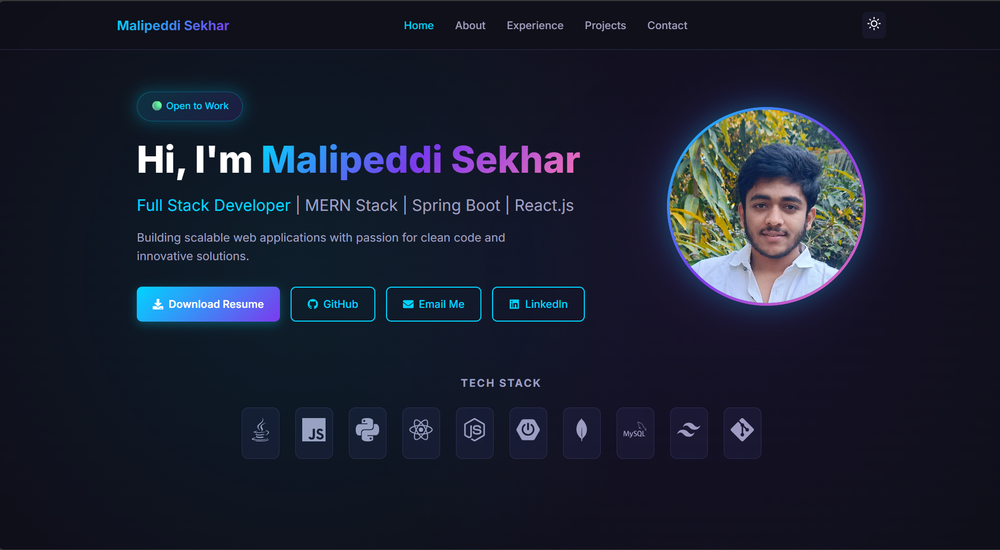

# 🚀 Sekhar Portfolio

A modern, responsive portfolio website built with the **MERN Stack** (MongoDB, Express.js, React, Node.js).

<br/>

<div align="center">

### ✨ **[▶ Click Here to View Live Portfolio](https://698b639906aad73ce7de6297--spontaneous-haupia-52ba4e.netlify.app/)** ✨

</div>

<br/>

---

## 📸 Screenshots

### Home Page


---

## ✨ Features

- 🎨 **Modern UI/UX** - Clean, minimalist design with smooth animations
- 📱 **Fully Responsive** - Optimized for all devices (desktop, tablet, mobile)
- 🌙 **Dark Theme** - Easy on the eyes with elegant color scheme
- 📧 **Contact Form** - Functional contact form with MongoDB backend
- ⚡ **Fast Performance** - Optimized for speed and SEO
- 🔗 **Social Links** - Direct links to GitHub, LinkedIn, and more

---

## 🛠️ Tech Stack

<table>
<tr>
<td align="center"><b>Frontend</b></td>
<td align="center"><b>Backend</b></td>
<td align="center"><b>Database</b></td>
<td align="center"><b>Deployment</b></td>
</tr>
<tr>
<td>
  
- React.js 18
- React Router v6
- React Icons
- CSS3 / Flexbox / Grid
- Axios

</td>
<td>

- Node.js
- Express.js
- CORS
- Nodemailer

</td>
<td>

- MongoDB Atlas
- Mongoose ODM

</td>
<td>

- Netlify (Frontend)
- Render (Backend)
- MongoDB Atlas

</td>
</tr>
</table>

---

## 📁 Project Structure

```
sekhar-portfolio/
│
├── 📂 client/                    # React Frontend
│   ├── public/
│   │   ├── index.html
│   │   └── screenshots/
│   └── src/
│       ├── components/           # Reusable components
│       │   ├── Navbar.jsx
│       │   └── Footer.jsx
│       ├── pages/                # Page components
│       │   ├── Home.jsx
│       │   ├── About.jsx
│       │   ├── Experience.jsx
│       │   ├── Projects.jsx
│       │   └── Contact.jsx
│       ├── styles/
│       │   └── index.css
│       ├── config.js
│       ├── App.jsx
│       └── index.js
│
├── 📂 server/                    # Node.js Backend
│   ├── models/
│   │   ├── Project.js
│   │   └── Contact.js
│   ├── routes/
│   │   ├── projects.js
│   │   └── contact.js
│   └── index.js
│
├── package.json
└── README.md
```

---

## 🚀 Getting Started

### Prerequisites

- **Node.js** (v16 or higher)
- **npm** or **yarn**
- **MongoDB** (local or Atlas)

### Installation

1. **Clone the repository**
   ```bash
   git clone https://github.com/malipeddisekhar/sekhar-portfolio.git
   cd sekhar-portfolio
   ```

2. **Install all dependencies**
   ```bash
   npm run install-all
   ```

3. **Set up environment variables**
   
   Create `.env` file in the server directory:
   ```env
   MONGODB_URI=your_mongodb_connection_string
   PORT=5000
   ```

4. **Run the application**
   ```bash
   # Run both client and server concurrently
   npm run dev
   ```

   Or run separately:
   ```bash
   npm run client   # React app on http://localhost:3000
   npm run server   # API server on http://localhost:5000
   ```

---

## 📜 Available Scripts

| Command | Description |
|---------|-------------|
| `npm run dev` | Run both client and server concurrently |
| `npm run client` | Start React development server |
| `npm run server` | Start Node.js backend server |
| `npm run install-all` | Install dependencies for root, client, and server |

---

## 🌐 Deployment

| Service | Purpose | URL |
|---------|---------|-----|
| **Netlify** | Frontend Hosting | [Live Site](https://698b639906aad73ce7de6297--spontaneous-haupia-52ba4e.netlify.app/) |
| **Render** | Backend API | [API Server](https://sekhar-portfolio-api.onrender.com) |
| **MongoDB Atlas** | Database | Cloud Database |

---

## 📱 Responsive Design

The portfolio is fully responsive across all device sizes:

- 📱 **Mobile** (320px - 480px)
- 📱 **Large Mobile** (481px - 768px)
- 💻 **Tablet** (769px - 1024px)
- 🖥️ **Desktop** (1025px+)

---

## 👨‍💻 Author

<div align="center">

### **Malipeddi Sekhar**

[](https://github.com/malipeddisekhar)
[](https://www.linkedin.com/in/malipeddi-sekhar-08650630b/)
[](mailto:malipeddisekhar63@gmail.com)

</div>

---

## 📄 License

This project is open source and available under the [MIT License](LICENSE).

---

<div align="center">

### ⭐ If you like this project, give it a star on GitHub! ⭐

**[🌐 View Live Demo](https://698b639906aad73ce7de6297--spontaneous-haupia-52ba4e.netlify.app/)**

</div>
